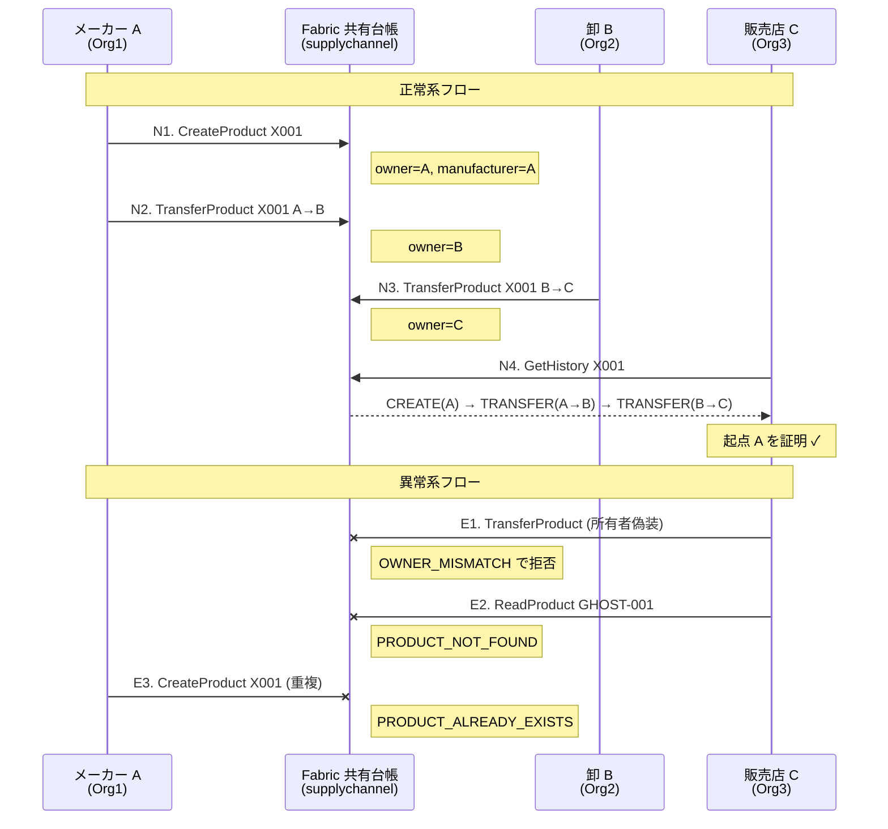

# hl-proto — Hyperledger Fabric サプライチェーン・トレーサビリティ PoC

製品が **メーカー A → 卸 B → 販売店 C** と流通する来歴を Fabric の共有台帳に記録し、**販売店 C が自組織の credential だけで起点 A を証明** できることを示すローカルデモ。

## デモ概要



- 正常系 N1〜N4 で「A 起点の来歴が C から検証できる」ことを実演
- 異常系 E1〜E3 で「書けないはずのものは書けない」ことを実演
- 実測 **5〜7 分**、ナレーション付きスクリプトで完結

## Quick Start

```bash
# 1. 前提ツール取得 + Fabric binaries / Docker image
./scripts/setup.sh

# 2. 3Org ネットワーク起動 + chaincode デプロイ
./scripts/network_up.sh
./scripts/deploy_chaincode.sh

# 3. デモ実行（正常系 → C 視点クライマックス → 異常系）
./scripts/demo_normal.sh
./scripts/demo_verify_as_c.sh
./scripts/demo_error.sh
```

> 一括: `./scripts/demo_normal.sh --fresh` で reset → 起動 → デプロイ → デモまで連動。

ブラウザ版デモ: `./scripts/web_demo.sh` → `http://localhost:3000` （組織切替・N1〜N4・E1〜E3 を GUI で実行）。手順は **[docs/web-demo-guide.md](docs/web-demo-guide.md)** 参照。

クリーンアップ: `./scripts/reset.sh --yes`

## 前提環境

| ツール | バージョン |
|---|---|
| OS | Ubuntu 22.04 (WSL2 可) / macOS (Apple Silicon, Colima 経由) |
| Docker | 29+ (`docker compose v2`) |
| Node.js | 18 LTS |
| jq | 1.6+ |

クリーン Ubuntu / macOS (Colima) 導入手順は **[docs/prerequisites.md](docs/prerequisites.md)** を参照。
> macOS では **Docker Desktop 非推奨**（socket proxy で chaincode install が壊れる。詳細 [docs/fabric-pitfalls.md](docs/fabric-pitfalls.md)）。Colima を使うこと。

## テスト

```bash
# L1 単体テスト（chaincode mock）
cd chaincode/product-trace && npm test

# L2 結合テスト（実ネットワーク）
./scripts/test_integration.sh
```

## ドキュメント

| ドキュメント | 内容 |
|---|---|
| [docs/demo-scenarios.md](docs/demo-scenarios.md) | N1〜N4 / E1〜E3 詳細台本 + 期待出力 |
| [docs/web-demo-guide.md](docs/web-demo-guide.md) | Web UI 版デモ手順 + REST API リファレンス |
| [docs/architecture.md](docs/architecture.md) | 組織 / Peer / Channel / Chaincode 図解 |
| [docs/prerequisites.md](docs/prerequisites.md) | 前提ソフトウェア + クリーン導入手順 |
| [docs/troubleshooting.md](docs/troubleshooting.md) | よくあるエラーと対処 |
| [docs/fabric-pitfalls.md](docs/fabric-pitfalls.md) | Fabric 落とし穴集（実装知見） |
| [docs/spec.md](docs/spec.md) | 機能仕様（凍結） |

## ライセンス

未定（PoC のため）。
