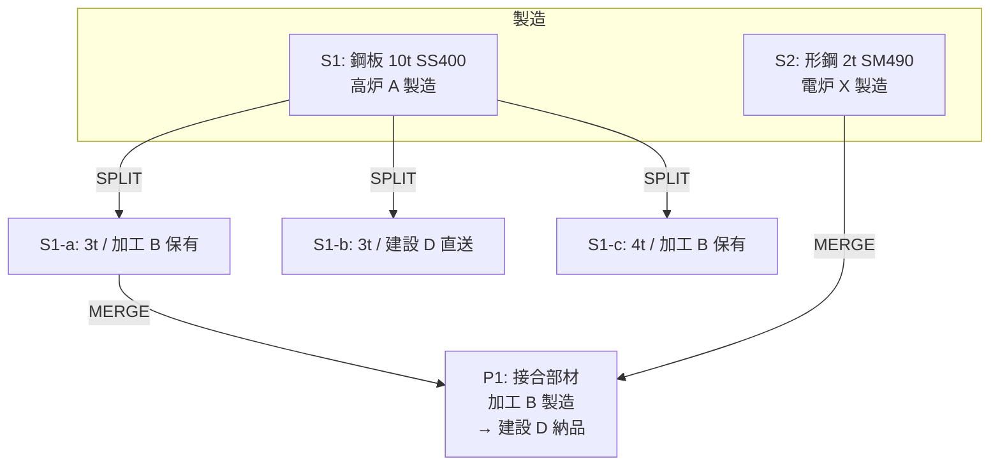

# hl-proto — Hyperledger Fabric 鋼材トレーサビリティ PoC (v2)

5 組織 (高炉/電炉メーカー + 加工業者 2 社 + 建設会社) のサプライチェーン上で、鋼材の **譲渡 / 分割 (1→N) / 接合 (N→1)** を Fabric 台帳に記録し、**建設会社 D が部材の祖先 DAG を遡って起点メーカーを検証** できることを示すローカルデモ。

> v1 (3Org / 1:1 譲渡) は `docs/spec.md` として凍結。現行仕様は `docs/spec-v2.md`。

## デモ概要 (複合シナリオ: 分割 → 接合 → 納品)



- `CreateProduct`, `TransferProduct`, `SplitProduct`, `MergeProducts`, `GetHistory`, `GetLineage` の 6 op
- 建設 D から `GetLineage(P1)` で **A/X 両系統の起点**まで遡る DAG を取得
- 各操作は chaincode レベルで決定性を保ち、書けないはずのものは endorsement で拒否

## 組織構成 (5Org)

| Org | MSP | 役割 | 権限 | ポート |
|---|---|---|---|---|
| Org1 | Org1MSP | 高炉メーカー A | Create | 7051 / 7054 |
| Org2 | Org2MSP | 電炉メーカー X | Create | 9051 / 8054 |
| Org3 | Org3MSP | 加工業者 B | Split/Merge | 11051 / 11054 |
| Org4 | Org4MSP | 加工業者 Y | Split/Merge | 13051 / 13054 |
| Org5 | Org5MSP | 建設会社 D | (検証) | 15051 / 15054 |

Endorsement policy: `OR('Org1MSP.peer',...,'Org5MSP.peer')`

## Quick Start

```bash
# 1. 前提ツール取得 + Fabric binaries / Docker image
./scripts/setup.sh

# 2. addOrg4/5 patch 生成 (1 度だけ)
./fabric/test-network-wrapper/gen_addorg.sh 4 13051 13054
./fabric/test-network-wrapper/gen_addorg.sh 5 15051 15054

# 3. 5Org ネットワーク起動 + chaincode デプロイ
./scripts/network_up.sh
./scripts/deploy_chaincode.sh

# 4. 複合シナリオ実行 (分割 → 接合 → 納品 → 系譜検証)
./scripts/demo_normal.sh
```

> 一括: `./scripts/demo_normal.sh --fresh` で reset → 起動 → デプロイ → デモまで連動。

**ブラウザ版デモ**: `./scripts/web_demo.sh` → `http://localhost:3000`
- 5 組織切替 / 新規素材登録 (ミルシート PDF ドロップで SHA-256 自動計算)
- 分割・接合フォーム / Mermaid による系譜 DAG 可視化

クリーンアップ: `./scripts/reset.sh --yes`

## 前提環境

| ツール | バージョン |
|---|---|
| OS | Ubuntu 22.04 (WSL2 可) / macOS (Apple Silicon, Colima 経由) |
| Docker | 29+ (`docker compose v2`) |
| Node.js | 18 LTS |
| jq | 1.6+ |

クリーン Ubuntu / macOS (Colima) 導入手順は **[docs/prerequisites.md](docs/prerequisites.md)** を参照。
> macOS では **Docker Desktop 非推奨** (socket proxy で chaincode install が壊れる)。Colima を使うこと。

**v2 で追加利用ポート**: 13051, 13054, 15051, 15054 (Org4/5 用)。

## テスト

```bash
# L1 単体テスト (chaincode mock, 71 ケース)
cd chaincode/product-trace && npm test

# L2 結合テスト (実 5Org ネットワーク)
./scripts/test_integration.sh
```

## ドキュメント

| ドキュメント | 内容 |
|---|---|
| [docs/spec-v2.md](docs/spec-v2.md) | **v2 仕様 (現行)** — データモデル / op / エラーコード |
| [docs/spec.md](docs/spec.md) | v1 仕様 (凍結、参照用) |
| [docs/demo-scenarios.md](docs/demo-scenarios.md) | デモシナリオ詳細台本 |
| [docs/web-demo-guide.md](docs/web-demo-guide.md) | Web UI 手順 + REST API リファレンス |
| [docs/architecture.md](docs/architecture.md) | 組織 / Peer / Channel / Chaincode 図解 |
| [docs/prerequisites.md](docs/prerequisites.md) | 前提ソフトウェア + クリーン導入手順 |
| [docs/troubleshooting.md](docs/troubleshooting.md) | よくあるエラーと対処 |
| [docs/fabric-pitfalls.md](docs/fabric-pitfalls.md) | Fabric 落とし穴集 (実装知見) |

## ライセンス

未定 (PoC のため)。
