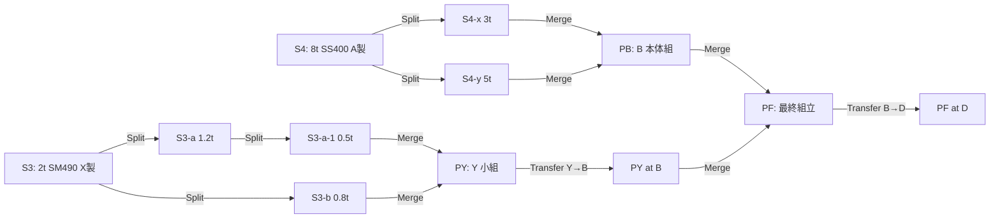
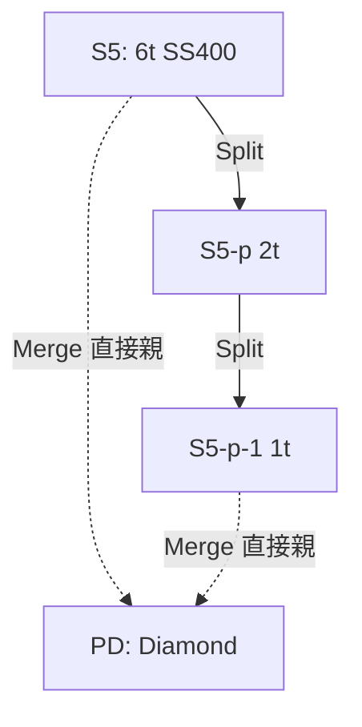

# デモシナリオ詳細 (v2 / 5Org)

`spec-v2.md` のシナリオを、デモ担当者が **実演しながら語れる** 粒度に展開したもの。3 部の正常系 + 拡張異常系で実測 10〜12 分（invoke 1 回 3〜6 秒 × 複数 + pause）。

> v1 (3Org A/B/C 譲渡のみ) のシナリオは git 履歴 (tag `phase6-done`) を参照。本ドキュメントは v2 (5Org + Split/Merge) 現行版。

---

## 目次

- [前提](#前提)
- [登場人物と語彙対応](#登場人物と語彙対応)
- [全体フロー](#全体フロー)
- [Part 1: 基本シナリオ（製造 → 分割 → 接合 → 納品）](#part-1-基本シナリオ製造--分割--接合--納品)
- [Part 2: Merge-of-Merge（多段組立）](#part-2-merge-of-merge多段組立)
- [Part 3: Diamond DAG（祖先再マージ）](#part-3-diamond-dag祖先再マージ)
- [Web UI 向けサンプル投入（demo_seed.sh）](#web-ui-向けサンプル投入demo_seedsh)
- [異常系シナリオ](#異常系シナリオ)
- [エラーコード一覧](#エラーコード一覧)
- [口頭ナレーション（30 秒 スコープ説明）](#口頭ナレーション30-秒-スコープ説明)
- [スコープ外](#スコープ外)

---

## 前提

- 5Org ネットワーク起動 + chaincode デプロイ済み（[`README.md`](../README.md#quick-start) 参照）
- 画面は 1 枚のターミナルで完結。事前に `./scripts/reset.sh --yes && ./scripts/network_up.sh && ./scripts/deploy_chaincode.sh` を済ませておく
- または `./scripts/demo_normal.sh --fresh` でクリーン状態から Part 1〜3 を一括実行可能

---

## 登場人物と語彙対応

| 業務語彙 | MSP ID | 役割 | chaincode 権限 |
|---|---|---|---|
| 高炉メーカー A | `Org1MSP` | 鋼板を製造 | `CreateProduct` 可 |
| 電炉メーカー X | `Org2MSP` | 形鋼を製造 | `CreateProduct` 可 |
| 加工業者 B     | `Org3MSP` | 切断・接合 | `Split` / `Merge`（現所有者時） |
| 加工業者 Y     | `Org4MSP` | 切断・接合 | `Split` / `Merge`（現所有者時） |
| 建設会社 D     | `Org5MSP` | 最終納品先・系譜の検証者 | 閲覧のみ |

内部 MSP ID は fabric-samples 標準の `Org1MSP`〜`Org5MSP`。表示層 `scripts/lib/format.sh` の `msp_to_role` で業務語彙に変換する。

Endorsement Policy: `OR('Org1MSP.peer','Org2MSP.peer','Org3MSP.peer','Org4MSP.peer','Org5MSP.peer')`

---

## 全体フロー

| 時間（目安） | フェーズ | スクリプト | 目的 |
|---|---|---|---|
| 0:00–1:00 | 課題提起 / 登場人物 | `demo_normal.sh` 冒頭 | 「なぜ必要か」を共有 |
| 1:00–3:30 | Part 1 基本シナリオ | `demo_normal.sh` (N1-N7) | 分割・接合・起点検証の基本動作 |
| 3:30–7:00 | Part 2 Merge-of-Merge | `demo_normal.sh` (P2-1〜P2-11) | 多段組立の DAG 表現 |
| 7:00–9:00 | Part 3 Diamond DAG | `demo_normal.sh` (P3-1〜P3-5) | 祖先再マージでも循環が起きないこと |
| 9:00–11:00 | 異常系 E1〜E5 | `demo_error.sh` | 「書けないはずのものは書けない」 |
| 11:00–12:00 | スコープと限界 | 口頭ナレーション | 物理真正性は別レイヤー |

※ invoke は 1 回あたり 3〜6 秒（endorsement + ordering + commit）。PC 性能や `DEMO_PAUSE` 環境変数で上下する。

---

## Part 1: 基本シナリオ（製造 → 分割 → 接合 → 納品）

**狙い**: 2 系統メーカー (A/X) の鋼材を 1 つの部材に接合し、建設会社 D が起点まで遡れる最小フローを示す。

### N1/N2: 鋼板 S1 (A) と形鋼 S2 (X) を製造

**コマンド**:
```bash
./scripts/invoke_as.sh org1 invoke CreateProduct "${S1}" Org1MSP Org1MSP \
  '{"category":"plate","grade":"SS400","weightKg":10000,"heatNo":"HT-A01"}' "" ""
./scripts/invoke_as.sh org2 invoke CreateProduct "${S2}" Org2MSP Org2MSP \
  '{"category":"shape","grade":"SM490","weightKg":2000,"heatNo":"HT-X01"}' "" ""
```

**検証ポイント**:
- `manufacturer == caller MSP` が必須（`INITIAL_OWNER_MISMATCH` で他社 Create は弾かれる）
- manufacturer フィールドは以降不変
- ミルシート (SHA-256 + URI) は optional 引数（空文字で省略可）

### N3: S1/S2 を加工業者 B に集約

`TransferProduct` を A/X の credential で呼ぶ。`fromOwner = caller MSP = currentOwner` の三点照合が通る。

### N4: 加工業者 B が S1 を 3 分割

**コマンド**:
```bash
./scripts/invoke_as.sh org3 invoke SplitProduct "${S1}" \
  '[{"childId":"S1-a","toOwner":"Org3MSP","metadataJson":"{\"weightKg\":3000}"},
    {"childId":"S1-b","toOwner":"Org5MSP","metadataJson":"{\"weightKg\":3000}"},
    {"childId":"S1-c","toOwner":"Org3MSP","metadataJson":"{\"weightKg\":4000}"}]'
```

**検証ポイント**:
- **親 S1 は ACTIVE のまま** （v1.3 以降の「切り出し」モデル）
- `parent.children` に `[S1-a, S1-b, S1-c]` が追記される（ソート済み）
- 子 3 つはそれぞれ独立した state entry として生成
- 子 1 (`S1-b`) は toOwner=Org5MSP で直送（建設 D に直接渡る）

### N5: B が S1-a + S2 を接合 → P1（柱材）

**コマンド**:
```bash
./scripts/invoke_as.sh org3 invoke MergeProducts '["S1-a","S2"]' \
  '{"childId":"P1","metadataJson":"{\"type\":\"welded\",\"purpose\":\"柱\"}"}'
```

**検証ポイント**:
- 全親が ACTIVE かつ caller 所有（`PARENTS_OWNER_DIVERGENT` / `PARENT_NOT_ACTIVE` を回避）
- 親 2 つは **CONSUMED に遷移**（Merge は親を消費する）
- 子 P1 の `parents = [S1-a, S2]`, `manufacturer = Org3MSP`（接合実施者）

### N6: P1 を建設 D に納品

TransferProduct で Org3MSP → Org5MSP。

### N7: 建設 D が P1 の系譜を検証

**コマンド**:
```bash
./scripts/invoke_as.sh org5 query GetLineage P1
```

**期待結果（整形後）**:
```
nodes:
  P1     manufacturer=Org3MSP  owner=Org5MSP  status=ACTIVE
  S1-a   manufacturer=Org1MSP  owner=Org3MSP  status=CONSUMED
  S2     manufacturer=Org2MSP  owner=Org3MSP  status=CONSUMED
  S1     manufacturer=Org1MSP  owner=Org3MSP  status=ACTIVE
edges:
  S1   ─SPLIT→ S1-a
  S1-a ─MERGE→ P1
  S2   ─MERGE→ P1
```

→ 起点が高炉 A (S1) と電炉 X (S2) の **2 系統** として可視化される。

---

## Part 2: Merge-of-Merge（多段組立）

**狙い**: 「親自身が前段 Merge の結果」という入れ子パターンでも DAG が正しく育つことを示す。実務では小組 → 本体組 → 最終組立と段階加工する現実的パターン。

### フロー概要



### P2-1 〜 P2-5: 加工 Y が小組ユニット PY を作り B に譲渡

1. 電炉 X が S3 (形鋼 2t) を製造 → Y へ譲渡
2. Y が S3 を 2 分割 → S3-a (1.2t), S3-b (0.8t)
3. Y が S3-a をさらに切り出し → S3-a-1 (0.5t) + S3-a は ACTIVE 継続
4. Y が S3-a-1 + S3-b を Merge → PY (Y 内製小組)
5. PY を Y→B に Transfer（**cross-fabricator**: 他組織の Merge 結果を受け取る）

### P2-6 〜 P2-10: 加工 B が本体組 PB を作り、PB + PY を最終接合

6. 高炉 A が S4 (鋼板 8t) を製造 → B へ譲渡
7. B が S4 を 2 分割 → S4-x (3t), S4-y (5t)
8. B が S4-x + S4-y を Merge → PB
9. **B が PB + PY を Merge → PF**（← Merge-of-Merge: 両親とも前段 Merge の結果）
10. PF を B→D に納品

### P2-11: 建設 D が PF の系譜を検証

`GetLineage PF` の結果で確認すべき点:
- nodes に S4, S3 (最上流の製造物) が含まれる
- edges に `PB ─MERGE→ PF`, `PY ─MERGE→ PF` の両方が出る
- 深さは最大 4 階層（PF → PY → S3-a-1 → S3-a → S3）

→ **親が Merge 結果でも通常の製造物でも、Lineage 走査は同じロジックで動く**。chaincode 側の分岐は parents.length の 0 / 1 / ≥2 のみ。

---

## Part 3: Diamond DAG（祖先再マージ）

**狙い**: ある素材を切り出して加工し、その結果を元の素材に戻して接合する ── という実務パターンでも、DAG として整合が保たれることを示す。

### フロー概要



### P3-1 〜 P3-4: 切り出し 2 段 + 祖先再マージ

1. 高炉 A が S5 (鋼板 6t) を製造 → B へ譲渡
2. B が S5 から S5-p (2t) を切り出し（S5 は ACTIVE 継続）
3. B が S5-p から S5-p-1 (1t) をさらに切り出し（S5-p も ACTIVE 継続）
4. **B が S5 + S5-p-1 を Merge → PD**（祖先と子孫の再マージ）

### P3-5: Diamond DAG を GetLineage で確認

`GetLineage PD` で edges を見ると:
```
S5    ─MERGE→ PD      (直接)
S5    ─SPLIT→ S5-p    (祖先経路1)
S5-p  ─SPLIT→ S5-p-1  (祖先経路2)
S5-p-1 ─MERGE→ PD     (直接)
```

→ **S5 への入エッジが 2 本**見える（直接 / 孫経由）。これがダイヤモンド型 DAG。

### 設計上の論点

- chaincode は「親が他の親の祖先に含まれる」かの検査をしない（Merge 時の祖先 walk は O(depth) で endorsement コストが増すため）
- 構造的には**循環は不可能**（新規 product は必ず既存より後に作成される = 位相順序あり）
- 「D の物質はどれだけ S5 由来か」を **経路本数で重み付けする集計は誤る**（集合として S5 を含むと判定するのが正しい）
- 業務上禁止したければ Web UI 側で警告する運用が現実的

---

## Web UI 向けサンプル投入（demo_seed.sh）

`./scripts/demo_seed.sh` を走らせると、上記 Part 1〜3 と同じパターンの素材を異なる productId (S-A-001 系 / P-B-020 / P-B-040 など) で冪等投入する。加えて **各社の手持ちが業務的にリアルな portfolio** になるよう、以下のカテゴリも投入される。

### 投入される素材のカテゴリ

| カテゴリ | 意図 | 例 |
|---|---|---|
| 完成済みの加工フロー | Part 1-3 と同形状の DAG を残すため | P-B-001, P-B-002, P-B-020, P-B-040 |
| **メーカー未出荷在庫** | A / X の portfolio が空にならないよう、複数ロットを製造直後の状態で保持 | S-A-006〜S-A-009, S-X-005〜S-X-009 |
| **加工業者の仕掛中案件** | 受入済み・分割済みだが接合前 ── 現実の WIP (work in progress) を再現 | S-A-010 + 子 / S-X-010 + 子 |
| **D への素材直送納品** | 別工区向けの通し納品 (X→Y→D) | S-X-011 |

### 投入後の手持ち素材一覧

| 組織 | 確認コマンド | 内容（主なもの） |
|---|---|---|
| 高炉 A | `./scripts/invoke_as.sh org1 query ListProductsByOwner Org1MSP` | S-A-002, S-A-006〜S-A-009（未出荷在庫 5 ロット） |
| 電炉 X | `./scripts/invoke_as.sh org2 query ListProductsByOwner Org2MSP` | S-X-005〜S-X-009（未出荷在庫 5 ロット: H形鋼 / アングル / チャンネル / 鉄筋） |
| 加工 B | `./scripts/invoke_as.sh org3 query ListProductsByOwner Org3MSP` | S-A-001 系残り, P-B-002, P-B-040, S-A-010 系 (仕掛中) など |
| 加工 Y | `./scripts/invoke_as.sh org4 query ListProductsByOwner Org4MSP` | S-X-002, S-X-004 系残り, S-X-010 系 (仕掛中) |
| 建設 D | `./scripts/invoke_as.sh org5 query ListProductsByOwner Org5MSP` | S-A-001-b, P-B-001, P-B-020, S-X-011（素材直送） |

### 取引・処理履歴の可視化

仕掛中案件 `S-A-010` は CREATE → TRANSFER (A→B) → SPLIT の 3 イベントを含む典型パターン:
```bash
./scripts/invoke_as.sh org3 query GetHistory S-A-010
```

### 系譜検証

```bash
./scripts/invoke_as.sh org5 query GetLineage P-B-001    # 単純 DAG
./scripts/invoke_as.sh org5 query GetLineage P-B-020    # Merge-of-Merge DAG
./scripts/invoke_as.sh org3 query GetLineage P-B-040    # Diamond DAG
```

---

## 異常系シナリオ

`demo_error.sh` と手動実行で実演できる 5 パターン。全て `throw new Error('[CODE] ...')` で endorsement failure を誘発し、block には載らない。

### E1: 所有者偽装（OWNER_MISMATCH）

現所有者ではない MSP が `fromOwner` を詐称して Transfer を試みる。

```bash
./scripts/invoke_as.sh org3 invoke TransferProduct X001 Org2MSP Org3MSP
# → [OWNER_MISMATCH] fromOwner does not match currentOwner
```

### E2: 未登録製品の照会（PRODUCT_NOT_FOUND）

```bash
./scripts/invoke_as.sh org3 query ReadProduct GHOST-001
# → [PRODUCT_NOT_FOUND] productId=GHOST-001
```

### E3: 重複登録（PRODUCT_ALREADY_EXISTS）

既存 productId を再度 CreateProduct する。

```bash
./scripts/invoke_as.sh org1 invoke CreateProduct X001 Org1MSP Org1MSP "" "" ""
# → [PRODUCT_ALREADY_EXISTS] productId=X001
```

### E4: CONSUMED 親の再利用（PARENT_NOT_ACTIVE）← v2 で追加

Merge 済みの親（CONSUMED）を再度 Split / Merge しようとする。

```bash
# P1 作成時に CONSUMED になった S1-a を再度 Merge しようとする
./scripts/invoke_as.sh org3 invoke MergeProducts '["S1-a","S1-c"]' \
  '{"childId":"P2","metadataJson":"{}"}'
# → [PARENT_NOT_ACTIVE] parent is not ACTIVE (status=CONSUMED)
```

### E5: 所有者分散 Merge（PARENTS_OWNER_DIVERGENT）← v2 で追加

Merge 対象の複数親を caller が全部所有していない状態で実行する。

```bash
# B が S1-a (B 所有) と S3 (Y 所有) を Merge しようとする
./scripts/invoke_as.sh org3 invoke MergeProducts '["S1-a","S3"]' \
  '{"childId":"PX","metadataJson":"{}"}'
# → [PARENTS_OWNER_DIVERGENT] parent currentOwner must equal caller
```

→ 正しい運用: 先に Transfer で caller 所有に集約してから Merge する（Part 2 の P2-5 で実演）。

---

## エラーコード一覧

| コード | 発生条件 | 対応 chaincode 関数 |
|---|---|---|
| `[INVALID_ARGUMENT]` | 引数不足 / JSON parse 失敗 / MSP ID 不正 | 全関数 |
| `[MSP_NOT_AUTHORIZED]` | 呼び出し主体 MSP が権限条件を満たさない | `CreateProduct` / `TransferProduct` / `SplitProduct` |
| `[INITIAL_OWNER_MISMATCH]` | 登録主体 ≠ initialOwner | `CreateProduct` |
| `[PRODUCT_NOT_FOUND]` | 指定 productId が未登録 | `ReadProduct` / `TransferProduct` / `SplitProduct` / `GetHistory` / `GetLineage` |
| `[PRODUCT_ALREADY_EXISTS]` | 既存 productId に CreateProduct | `CreateProduct` |
| `[CHILD_ALREADY_EXISTS]` | Split/Merge の childId が既存または重複 | `SplitProduct` / `MergeProducts` |
| `[OWNER_MISMATCH]` | 呼び出し主体 ≠ 現所有者 / fromOwner | `TransferProduct` |
| `[PARENT_NOT_ACTIVE]` | Split/Merge 対象の親が CONSUMED | `SplitProduct` / `MergeProducts` / `TransferProduct` |
| `[PARENTS_OWNER_DIVERGENT]` | Merge の親が caller 以外に所有されている | `MergeProducts` |
| `[LINEAGE_DEPTH_EXCEEDED]` | 祖先 DAG の深さが 20 を超える | `GetLineage` |
| `[INVALID_METADATA]` | metadata が object でない / JSON 不正 | `CreateProduct` / `SplitProduct` / `MergeProducts` |

全て `throw new Error('[CODE] ...')` で endorsement failure を誘発する形式。詳細は [`fabric-pitfalls.md`](fabric-pitfalls.md) §chaincode エラーは message 本文しか伝搬しない 参照。

---

## 口頭ナレーション（30 秒 スコープ説明）

デモ末尾で必ず語るべき 30 秒スクリプト（`demo_normal.sh` 末尾にも埋め込み済み）:

> **このデモが示すのは「台帳に載った情報は改ざんされない」ことです。**
>
> 鋼材は分割・接合の多段加工を経て建設現場に届きます。台帳には各操作で parents/children の関係が自動記録され、建設会社はいつでも起点メーカーまでの DAG を辿れます。Merge-of-Merge や Diamond DAG のような複雑形状でも、循環せず一貫性が保たれます。
>
> 逆に言えば、台帳に載せる前 ── **モノ自体の真正性** ── は別レイヤーの論点になります。
>
> - 現物のすり替え
> - 偽タグの貼付
> - productId と物理鋼材の紐付けズレ
>
> これらは QR コード / RFID / IoT センサー / ミルシート PDF の SHA-256 照合など、物理世界側の仕組みと組み合わせて補う前提です。
>
> 本 PoC はあくまで **組織間で譲渡・加工履歴を共有・検証する部分** を扱います。

---

## スコープ外

`spec-v2.md` §非対象領域に基づく。デモ中に質問された場合の回答テンプレート:

### 物理真正性は保証しない（最重要）

**保証する**: 台帳上の来歴（分割・接合を含む）の一貫性、参加者間で共有された記録の改ざん困難性

**保証しない**: 現実世界の物理鋼材が本当に当該 productId に対応していること

- **QR コード貼付** — シールを剥がして別鋼材に貼り替える攻撃には無力
- **RFID タグ** — タグ自体の複製 / リーダー側での入力改ざん
- **IoT センサー連携** — センサーデータの真正性は別途担保が必要
- **ミルシート PDF** — 記録されるのは SHA-256 と URI のみ。PDF そのものの差し替えは別途検知必要

### 質量保存則は未検証

`Split A (10t) → [B(3t), C(3t), D(4t)]` のような重量の整合性を chaincode は検証しない。
`B(3t) + C(5t) → P(100t)` と宣言しても通る。metadata の `weightKg` は参考値として記録するのみ。
業務ルール層（Web UI / 外部 ERP 連携）で実装する前提。

### GetLineage の深さ上限

`LINEAGE_MAX_DEPTH = 20` で打ち切り（`[LINEAGE_DEPTH_EXCEEDED]`）。
無限ループ防御と endorsement コスト上限のため。20 段以上の多段加工を扱う業種では要見直し。

### その他の非対象

- 本番運用向けの HA（Raft 単一 orderer のため）
- 大規模性能試験
- 外部 ERP / 在庫管理システムとの本格連携
- 高度な秘密計算 / プライバシー強化技術の統合
- Fabric CA 発行の end-user cert による細粒度認可（現状は Admin MSP 固定）

---

## デモ後の Q&A 想定

| 想定質問 | 回答要旨 |
|---|---|
| 「誰が書き換えを試みても止まるの？」 | chaincode の所有者 / status 検査 + endorsement policy の 2 段で止まる。E1/E4/E5 が実演例 |
| 「QR コードを貼り替えられたら？」 | **台帳の外の話**。上述「物理真正性は保証しない」を参照 |
| 「1 社だけが嘘をついたら？」 | OR ポリシーでも chaincode 内の所有者検査 (`ctx.clientIdentity.getMSPID()` と現所有者の一致) が決定的な防御。本番運用では `AND` 化で二重防御 |
| 「祖先を再 Merge したときに無限ループしないか？」 | Part 3 で実演。構造的に循環は不可能。`LINEAGE_MAX_DEPTH=20` で物理的な長さ上限も担保 |
| 「重量が合わないまま台帳に載せたら？」 | 載る（chaincode は検証しない）。これは業務ルール層 / 物理計測装置で担保する設計判断 |
| 「本番でも使える？」 | いいえ、PoC。HA / 性能 / CA 運用 / キー管理などは別途設計必要 |

---

## 関連ドキュメント

- [`README.md`](../README.md) — セットアップ・コマンドリファレンス
- [`spec-v2.md`](spec-v2.md) — 機能仕様 (v2 現行)
- [`architecture.md`](architecture.md) — 構成図
- [`web-demo-guide.md`](web-demo-guide.md) — Web UI 手順
- [`fabric-pitfalls.md`](fabric-pitfalls.md) — 実装時の落とし穴集
